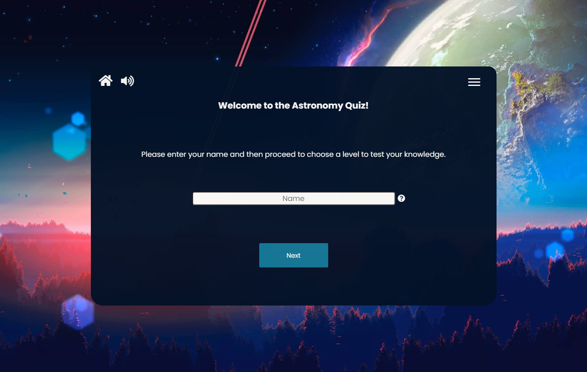
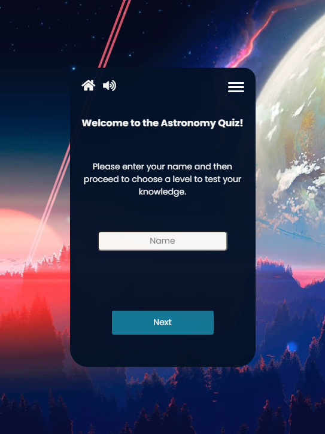
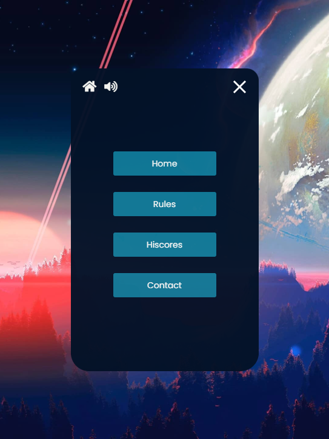
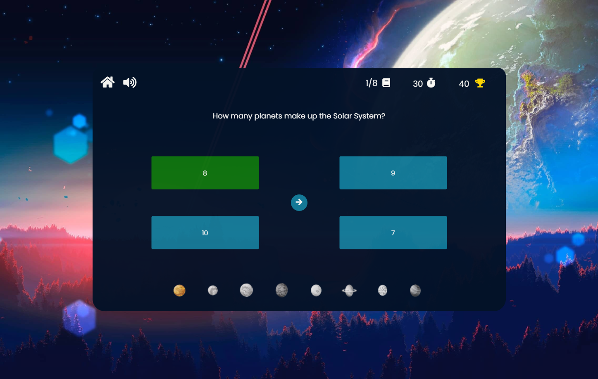
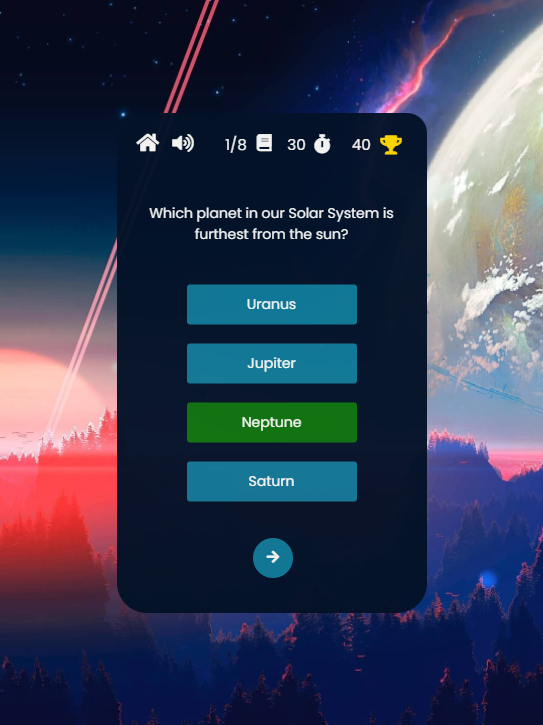
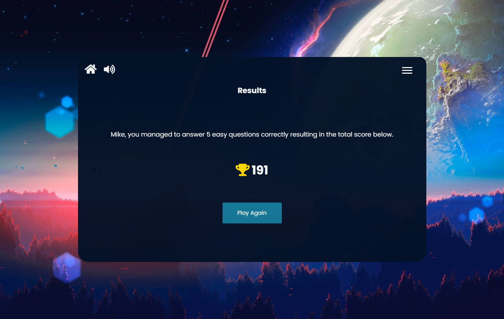
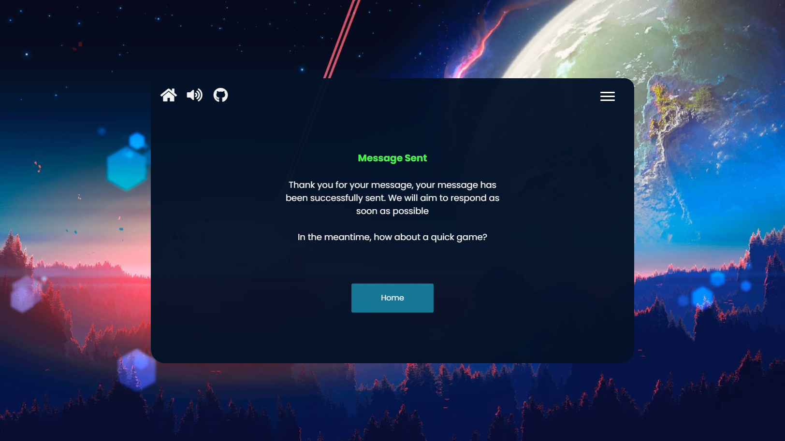
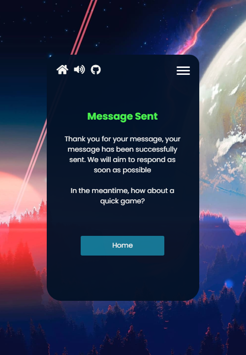
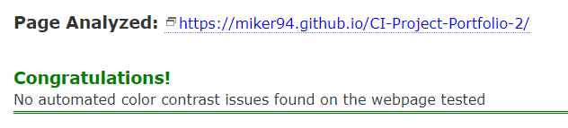
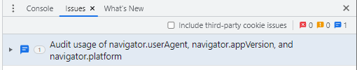

# **_The Astronomy Quiz - Project Portfolio 2 - JavaScript_**

The Astronomy Quiz is a small quiz that allows players to test their knowledge of Astronomy. The quiz consists of 3 different levels for the player to choose from, giving more points for harder difficulties. The quiz has 8 questions for each category and if they manage to answer the question correctly, they will receive points based on the difficulty plus additional points for answering the question as fast as they can. The Astronomy Quiz is a brilliant way to not only test your knowledge but also to learn, as the answer will be shown to the player if they either don't answer in time or answer incorrectly.

You can view the live site here - <a href="https://miker94.github.io/CI-Project-Portfolio-2/" target="_blank" rel="noopener">The Astronomy Quiz</a>

# Contents

* [**Objective**](<#objective>)
* [**User Experience UX**](<#user-experience-ux>)
    * [Design Prototype](<#design-prototype>)
    * [Site Structure](<#site-structure>)
    * [Design Choices](<#design-choices>)
    *  [Typography](<#typography>)
    *  [Colour Scheme](<#colour-scheme>)
* [**Features**](<#features>)
    * [Home](<#home-section>)
    * [Navigation](<#navigation-bar>)
    * [Difficulty](<#difficulty-section>)
    * [Question](<#question-section>)
    * [Results](<#results-section>)
    * [Rules](<#rules-section>)
    * [Hiscore](<#hiscore-section>)
    * [Contact](<#contact-section>)
    * [Timer](<#timer>)
    * [Score](<#score>)
    * [Audio](<#audio>)
    * [Planet Bar](<#planet-bar>)
* [**Future Features**](<#future-features>)
    * [Global Hiscores](<#global-hiscores>)
    * [Fact Of The Week](<#fact-of-the-week>)
    * [Monthly Polls](<#monthly-polls>)
    * [Global Sound](<#global-sound-settings>)
* [**Technologies Used**](<#technologies-used>)
* [**Testing**](<#testing>)
* [**Deployment**](<#deployment>)
* [**Credits**](<#credits>)
    * [**Content**](<#content>)
    * [**Media**](<#media>)
    * [**Code**](<#code>)
*  [**Acknowledgments**](<#acknowledgements>)

# Objective

In my second project, I intend to create a challenging, interactive and fun quiz game for player to test their knowledge on Astronomy. The main objective is to demonstrate competency in HTML, CSS and JavaScript alongside showcasing attention to detail and the importance of thorough testing.

[Back to top](<#contents>)

# User Experience (UX)

## Design Prototype

The design prototype for The Astronomy Quiz was produced in [Figma](https://www.figma.com/). There are design prototypes for Desktop and Mobile. The reason that the design prototype looks very similar to the finished product is because I've learnt that being able to visually see your design before you spend the time implementing it is a very efficient method when it comes to creating something in software development. Being able to use a tool like [Figma](https://www.figma.com/) to "drag and drop" elements will save a large amount of time as apposed to trying to design through CSS, therefore before I implemented something, I made sure to design it on [Figma](https://www.figma.com/) first.  

[Back to top](<#contents>)

## Site Structure

The Astronomy Quiz is a one-page website which has been designed to look like an application. When a player visits the website, they are instantly greeted on the [Home Page](index.html) and asked to enter a username. The quiz is very linear and clear so that the player is never left confused on how to play or what to do. The quiz also has a hamburger menu which the player can select to navigate to additional pages such as **Home**, **Rules**, **Hiscores** and **Contact**. When the player has finished the quiz, they will be presented with a score and then the option to play again which, if clicked, will take the player back to the [Home Page](index.html).

[Back to top](<#contents>)
## Design Choices

 * ### Typography
      The fonts chosen were 'Poppins' for the headings and for the body text however different font-weights and font-sizes were used to give further clarity. They fall back to sans-serif respectively if the Poppins font can't be loaded. 
     *  'Poppins' was chosen for the primarily to give the player an initial welcoming feel. The font-style is very modern and clean and gives a professional and inviting feeling to the website.

 * ### Colour Scheme
      The colour scheme eventually chosen is one based on primarily dark navy, light blue and an off white with the additional soft pink in the background image. This colour scheme gives off a very outer-space like feel and all colours compliment each other.  

[Back to top](<#contents>)
# Features

The Astronomy Quiz website is set up to be very easy to use and visually appealing for the player. It was designed with player-experience in mind. The player should feel like they are doing an Astronomy Quiz just by the visual theme and feel encouraged to keep playing to try and beat their current hiscore.

## Existing Features
  * ### Home Section

      * This is the first part of the quiz the player will see when visiting and is designed to allow the player to immediately get started with playing the quiz.
      * In the middle of the website the player will see the quiz application complimented by a beautiful space background.
      * Within the quiz application, the player will be greeted and then asked to submit a name and then click next to be directed to select a difficulty.
      * If the player inputs a name that doesn't meet validation, the player will be given feedback on how to fill the name input correctly.  

<b>Desktop Home/Landing Page Image</b>

 

<b>Responsive Home/Landing Page Image</b>

 

[Back to top](<#contents>)

  * ### Navigation Bar

    * Located at the top of the quiz application and provides the player the ability to navigate back to the home page, enter the menu and turn the game sounds on or off. Whilst the player is currently playing the quiz, the hamburger icon will disappear and will be replaced with additional features such as "Current Question Number", "Time Left" and "Score" to give the player more information and provide a better player experience.  

<b>Desktop Navigation Bar Image</b>

 

<b>Desktop Navigation Bar Image (During Quiz)</b>

 

<b>Responsive Navigation Bar Image (During Quiz)</b>

 

[Back to top](<#contents>)

  * ### Menu Section
    * I implemented a menu that the player can access at all times by pressing the 3 white lines in the top right. When pressed, these 3 white lines will disappear, a cross will be shown and then the menu will appear.
    * The player will have access to 4 navigation buttons **Home**, **Rules**, **Hiscores** and **Contact**.
    * If the player opens the menu during answering quiz questions, the game will not pause. This should promote fair play for all players.    

<b>Desktop Menu Image</b>

 

<b>Responsive Menu Image</b>

 

[Back to top](<#contents>)

  * ### Difficulty Section

    * After the player has entered their name and clicked the next button on the home page, they will then be directed to this page where they can select a difficulty.
    * The name that the player entered on the home page will be saved as a variable and used throughout the quiz to display personal messages.
    * The quiz has 3 difficulty levels to choose from. Selecting easy will give 10 points per correct answers, medium will give 20 points per correct answer and hard will give 40 points per correct answer.  

<b>Desktop Difficulty Image</b>

 

<b>Responsive Difficulty Image</b>

 

[Back to top](<#contents>)

* ### Question Section
    
    * This is the core of the game. The player is asked to answer 8 questions that are Astronomy related and the difficulty of the questions will be determined by what difficulty the player selects in the difficulty section
    * I decided to do 8 questions as there are 8 planets in our solar system. It's a small niche addition that hopefully the player may spot.
    * Each question is randomly displayed from a list of pre-determined questions created from questions.js.
    * If the player answers a correct answer, a "correct sound" noise will play, the correct answer will highlight green, the planet icon will light up, the time will pause and the player will receive points determined by difficulty for answering the question plus additional points equal to the time left. The next question icon will then become clickable after 0.5 seconds.
    * If the players answers incorrectly, an "incorrect sound" noise will play, the correct answer will highlight green, the players selected answer will highlight red and the player will not score points. The next question icon will then become clickable after 0.5 seconds.
    * If the players fails to answer within 30 seconds, the correct answer will highlight green, the incorrect answers will highlight red and the player will not score points. The next question icon will then become clickable after 0.5 seconds.  
    

<b>Desktop Question Image</b>

 

<b>Desktop Question Correct Answer Image</b>

 

<b>Desktop Question Wrong Answer Image</b>

 

<b>Desktop Question No Time Left Image</b>

 

<b>Responsive Question Image</b>

 

<b>Responsive Question Correct Answer Image</b>

 

<b>Responsive Question Wrong Answer Image</b>

 

<b>Responsive Question No Time Left Image</b>

 

[Back to top](<#contents>)

* ### Results Section
    
    * When the player finishes the quiz, they will then presented with a results page which will display the players score and then give them the option to play again if they wish to.
    * The players name that was entered prior to the quiz starting will be used to display a personal message at the end along with giving the player further information in the personal message such as difficulty level, correct questions answered and the final score.  
    

<b>Desktop Results Image</b>

 

<b>Responsive Results Image</b>

 

[Back to top](<#contents>)

* ### Rules Section
    
    * Created to give the player a further understanding of the game and can be accessed via the menu.
    * As well as having informative text, additional icons have been added to further aid the player in understanding.  
    

<b>Desktop Rules Image</b>

 

<b>Responsive Rules Image</b>

 

[Back to top](<#contents>)

* ### Hiscore Section
    
    * Shows the player the current top 3 hiscores.
    * All scores are saved in local storage so players can only compete with anyone who attempts the quiz on the same machine.
    * The player has the ability to clear the hiscores and start fresh if they wish to do so.  
    

<b>Desktop Hiscores Image</b>

 

<b>Responsive Hiscores Image</b>

 

[Back to top](<#contents>)

* ### Contact Section
    
    * Allows the player to submit any feedback, questions or concerns they may have.
    * Created with [Email.JS](https://www.emailjs.com/) and allows for emails to be sent directly to a new email address created for this project.
    * Additional functionality added to provide the player some visual feedback if their message fails to send.
    * Confirmation "Sent Message" screen to give the player confidence that their message has been successfully sent.  
    

<b>Desktop Contact Image</b>

 

<b>Desktop Contact Sent Image</b>

 

<b>Responsive Contact Image</b>

 

<b>Responsive Contact Sent Image</b>

 

[Back to top](<#contents>)

* ### Timer
    
    * Implemented to add a further dynamic to the quiz.
    * Works in tandem with the score system. Remaining time is added to the score.
    * Time will visibly turn red when the time left is 10 seconds or less.
    * The player will have 30 seconds to answer any question regardless of difficulty level.
    * Time will reset back to 30 seconds upon loading the next question.   
    

<b>Timer Image (Time left above 10 seconds)</b>

 

<b>Timer Image (Time left below 10 seconds)</b>

 

[Back to top](<#contents>)

* ### Score
    
    * Enhances player experience and increases replayability as players might wish to try beat their current score.
    * The points awarded is determined by the current level selected + time left remaining. Adding the remaining time to the score adds yet another dynamic to the game, encouraging the player to answer fast.
    * The score system has been thoroughly tested and there are no known bugs which the player can exploit to manipulate their score.    
    

<b>Score Image</b>

 

[Back to top](<#contents>)

* ### Current Question Indicator
    
    * Provides the player with a clear indication as to which question number they are currently on.  
    

<b>Current Question Image</b>

 

[Back to top](<#contents>)

* ### Audio
    
    * Gives the player additional information and feedback when navigating the quiz.
    * Correct sound audio played only when an answer is answered correctly.
    * Incorrect sound audio played only when an answer is answered incorrectly.
    * Button Click sound audio played only when the player clicks on a button.
    * Can be toggled off and on by clicking the sound icon in the top left.  
    

<b>Audio On Image</b>

 

<b>Audio Off Image</b>

 

* ### Planet Bar
    
    * Located at the bottom of the quiz, the planet tracker will initially start with all the planets greyed out. If the player answers a question correctly, the planet will then have colour.
    * If the player answers incorrectly or fails to answer within time, the planet will remain greyed out.
    * A small visual addition to encourage the player to answer all questions correctly to see all the planets light up.  
    

<b>Greyscale Planet Bar Image</b>

 

<b>Colour Planet Bar Image</b>

 

[Back to top](<#contents>)

* ## Future Features 

* ### Global Hiscores

    * Instead of hiscores saving locally, having the hiscores save globally would be much engaging for the player as they would be able to compete with others around the world to test their knowledge.

* ### Fact Of The Week

    * Having a page dedicated to displaying interesting Astronomy facts weekly would increase the the chances of people returning to the website/quiz application to see the new fact.

* ### Monthly Polls

    * Having a poll section where the player can submit their vote on a poll and then see results from others around the world would be a good way of seeing peoples different views and opinions on astronomy related topics. For example, "Which is your favourite planet?".

* ### Global Sound Settings

    * I believe it would be much more intuitive to save the players sound settings so that when the player refreshes the page, they don't have to keep turning the sound off every time if they don't wish to hear sound.

[Back to top](<#contents>)

# Technologies Used
* [HTML5](https://en.wikipedia.org/wiki/HTML) - Provides the content and structure for the website.
* [CSS3](https://en.wikipedia.org/wiki/CSS) - Provides the styling for the website.
* [JavaScript](https://en.wikipedia.org/wiki/JavaScript) - Provides the functionality of the website.
* [Figma](https://www.figma.com/) - Used to create the design prototype.
* [a11y](https://color.a11y.com/Contrast/) - Used to test the contrast and accessibility.
* [Favicon](https://favicon.io/) - Used to create the favicon.
* [Compressor](https://compressor.io/) - Used to compress the images.
* [VSCode](https://code.visualstudio.com/) - Used to create and edit the website.
* [GitHub](https://github.com/) - Used to host and deploy the website.
* [GitBash](https://en.wikipedia.org/wiki/Bash_(Unix_shell)) - Terminal used to push changes to the GitHub repository.
* [EmailJS](https://www.emailjs.com/) - Used to implement a working email system.
* [removebg](https://www.remove.bg/) - Used to remove background images.
* [Mobile Simulator](https://chrome.google.com/webstore/detail/mobile-simulator-responsi/ckejmhbmlajgoklhgbapkiccekfoccmk) - Used to test the quiz whilst on a mobile device
* [Google Chrome DevTools](https://developer.chrome.com/docs/devtools/) - Used to test responsiveness and debug
* [Responsive Design Checker](https://www.responsivedesignchecker.com/) - Used to test responsiveness

[Back to top](<#contents>)

# Testing

* ## Code Validation

    * The Astronomy Quiz has been thoroughly tested. All the code has been validated via the [W3C HTML Validator](https://validator.w3.org/), the [W3C CSS Validator](https://jigsaw.w3.org/css-validator/) and the [JSHint Validator](https://jshint.com/). 3 HTML errors, 1 HTML warning and 4 CSS warnings were found when tested on [HTML Validation](https://validator.w3.org/) and [W3C CSS Validator](https://jigsaw.w3.org/css-validator/) but were fixed immediately and documented below.  

* ### HTML Validation Image

    

* ### CSS Validation Image

    

* ### JS Validation Image

    * As for JavaScript, I have multiple JavaScript files which provide the functionality for specific features within the quiz. I decided to do this to provide better readability for anyone who wishes to read the code behind this project. When I put each individual file through [JSHint Validator](https://jshint.com/), I noticed a few errors that were showing such as unused variables and undefined variables however I realised that is because I have not exported and imported variables and functions. I did look into this and found some very good documentation on it at [JavaScript.Info](https://javascript.info/import-export) but after speaking with my mentor, he said that it was not mandatory as the course has not yet covered it. To further solidify that I did not have any unused variables or undefined variables, I decided to create a file called combined.js which has all the JavaScript code for the quiz and put that one file through the [JSHint Validator](https://jshint.com/)   

    

* Undefined Variable - emailjs 
    * I tried multiple times to fix this issue but because I was using [EmailJS](https://www.emailjs.com/) for my contact form, I was unable to declare these variables or change them.   
* Warning 1 
    * ***Expected an assignment or function call and instead saw an expression***. This warning is caused by line 10 in audio.js. I have spoken to my mentor about this warning and he has said that this is absolutely fine.   
* Warning 2 
    * ***Functions declared within loops referencing an outer scoped variable may lead to confusing semantics***. This warning is caused by the for loops I have which loop through a class and then add a click event listener which will toggle the hide class on and off. This allows me to have more concise HTML as I only need to reference one class instead of having multiple different ID's for each different game section but for the same element. I have spoken to my mentor about this warning and he has said that this is also fine and will cause no problems.   

* ## Lighthouse Testing 

    * Furthermore the website has been through the [Chrome Dev Tools](https://developer.chrome.com/docs/devtools/) and [Microsoft Edge Dev Tools](https://docs.microsoft.com/en-us/microsoft-edge/devtools-guide-chromium/open/?tabs=cmd-Windows) Lighthouse Testing which tests the website for the following:
        * Performance - How the page performs whilst loading.
        * Accessibility - Is the site accessible for all players and how can it be improved.
        * Best Practices - Site conforms to industry best practices.
        * SEO - Search Engine Optimisation. Is the site optimised for search engine result rankings.  

* ### Edge Desktop Lighthouse Result

    

* ### Edge Mobile Lighthouse Result

    

* ### Chrome Desktop Lighthouse Result

    

* ### Chrome Mobile Lighthouse Result

    

* ## Accessibility Testing
    * I also put the website through [a11y](https://color.a11y.com/Contrast/) to further test the contrast and found no issues.    

    

* ## Responsiveness Testing
    * The responsive design tests were carried out manually with [Google Chrome DevTools](https://developer.chrome.com/docs/devtools/) and [Responsive Design Checker](https://www.responsivedesignchecker.com/).  

    

* ## Real World Testing
    * Although checking the responsiveness via [Google Chrome DevTools](https://developer.chrome.com/docs/devtools/) and [Responsive Design Checker](https://www.responsivedesignchecker.com/), I quickly noticed that these tests, whilst still vital and good, don't actually give me 100% accurate results as they don't show mobile keyboards and how that effects the website. After running into a bug ([explained here](<#bugs-fixed>)), I downloaded a Google Chrome Extension called [Mobile Simulator](https://chrome.google.com/webstore/detail/mobile-simulator-responsi/ckejmhbmlajgoklhgbapkiccekfoccmk) which can simulate mobile devices which will show the keyboard and the effect it has on the website  

    

* ## Future Responsive Updates
    * Whilst every effort has been made to account for any and all devices, due to the nature of the quiz application, some devices may be too small to fully support the quiz. The devices that will be unable to support the quiz at the moment will be older devices, devices with very small screens and smart watches. Future updates would consider the "business benefit" of making these devices compatible given the time and resources it could potentially consume.  

* ## Compressing Images
    * All images have been compressed with [Compressor](https://compressor.io/) and I managed to save a total of 735 KB.  

    

* ## Manual Testing
    * In addition to the other tests, I have conducted a manual check list for myself to carry out to make sure that everything is working as intended.

   * ### Manual Tests Conducted
      * Home/Landing Section
        * Verify that clicking on the home icon reloads the website to the home page
        * Verify that clicking the sound icon will toggle the audio
        * Verify that clicking the hamburger icon will open the menu
        * Verify that clicking the next button without a valid name will prompt the player and not go to the difficulty page
        * Verify that clicking the next button with a valid name will go to the difficulty page
        * Verify that hovering over the tooltip will show the player some helpful information on how to enter a correct name
      * Menu/Navigation Section
        * Verify that clicking the hamburger icon will open the menu and the hamburger icon will become a cross icon
        * Verify that clicking the cross icon will close the menu and the cross icon become a hamburger icon
        * Verify that clicking the home button within the menu will reload the website to the home page
        * Verify that clicking the rules button within the menu will load the rules page
        * Verify that clicking the hiscores button within menu will load the hiscores page
        * Verify that clicking the contact button within the menu will load the contact page
        * Verify that clicking any of the aforementioned menu buttons will hide the menu and show the correct page
      * Difficulty Section
        * Verify that clicking the easy button will load the easy questions in a random order
        * Verify that clicking the medium button will load the medium questions in a random order
        * Verify that clicking the hard button will load the hard questions in a random order
        * Verify that the players name is displayed within the "Great stuff" message
      * Question Section
        * Verify that the question and the answers are displayed correctly
        * Verify that the hamburger icon will disappear
        * Verify that the score icon will show and will accurately increase score
        * Verify that the timer will show and will count down from 30 seconds to 0 seconds
        * Verify that the timer will turn red when the time left is 10 seconds or less
        * Verify that the timer will reset back to 30 seconds when the next question is loaded
        * Verify that the players selected answer is highlighted correctly (green = correct / red = incorrect)
        * Verify that if the player selects a correct answer the "correct" audio sound will play
        * Verify that if the player selects an incorrect answer the "incorrect" audio sound will play
        * Verify that if the player doesn't select an answer and runs out of time, the correct answer is shown and the player doesn't score points
        * Verify that the next question icon is greyed out and un-clickable whilst the question is unanswered and there is time remaining
        * Verify that the next question icon returns to colour and is clickable if the question is answered and if there is no time remaining
        * Verify that the next question icon correctly loads the next question if there are questions remaining
        * Verify that the next question icon correctly loads the results page if there are no more questions remaining
        * Verify that the planet icons turn to colour if the player answers a question correctly and remain greyed out if they get it wrong or don't answer
        * Verify that the answer buttons become un-clickable when the question has been answered or the time has run out
        * Verify that the answer buttons become clickable when the next question is loaded
        * Verify that the current question icon correctly shows the player what question number they are on
      * Results Section
        * Verify that the players name is displayed in the "you managed" message
        * Verify that the correct amount of answers is displayed in the "you managed" message
        * Verify that the correct difficulty level is displayed in the "you managed" message
        * Verify that the players score is displayed correctly
        * Verify that the "Play Again" button will reload the website and go to the home page when clicked
     * Rules Section
        * Verify that the rules page is displayed correctly
        * Verify that any icons used within the rules page are not clickable
     * Hiscores Section
        * Verify that the hiscores list gets updated when a player has completed the quiz and has refreshed the website
        * Verify that the "Clear Hiscores" button reloads the website and then clears the hiscores list so that it is empty
     * Contact Section
        * Verify that the name input gives the player feedback if the name input doesn't validate
        * Verify that the email input gives the player feedback if the email input doesn't validate
        * Verify that the message input gives the player feedback if the message input doesn't validate
        * Verify that the "Sent Message" page is displayed if the contact form has been filled in correctly and the message as been successfully sent
        * Verify that hovering over the tooltip next to name input will show the player some helpful information on how to enter a correct name
        * Verify that hovering over the tooltip next to email input will show the player some helpful information on how to enter a correct email
        * Verify that hovering over the tooltip next to message input will show the player some helpful information on how to enter a correct message
          

* ## Browser Compatibility
    * The website has had manual and responsive tests conducted on the below browsers with additional Lighthouse testing on Google Chrome and Microsoft Edge and I was presented with no issues.
        * Google Chrome
        * Microsoft Edge
        * Safari
          

* ## Bugs Fixed 

    ### Size Error Flicker
        
    * After testing the quiz via website tools, I decided to test it on my iPhone 7 Plus and had no errors whatsoever. I then sent it to my friend who has a Huawei P30 Pro and he was presented with the below issue  

    

<b>Size Error Flicker GIF (EPILEPSY WARNING)</b>

    
    
 

    * After spending many hours trying to debug this issue on my own and then with Code Institute Tutor Rebecca, it was my brother [Jack Ralph](https://www.linkedin.com/in/jackthomasralph/) that quickly noticed that the problem wasn't as complicated as I once thought. The error was showing because I had a media query that displayed an error message if the players screen width and height wasn't large enough to support the quiz. As soon as I removed that media query, the bug was fixed, however I've noticed in programming that you fix one bug it can then generate multiple other bugs or problems. In my case, I now didn't have anything detecting if the device was too small to support the quiz. So I was stuck with a problem, I needed to remove the media query to allow keyboards so players can enter information and I needed the quiz to be fully responsive across all devices. After many hours of theorising and coming up with multiple solutions, I decided that having the quiz in landscape mode whilst on a mobile device was not practical for the player experience and decided to implement JavaScript that would detect if the player is on a mobile device and is also in landscape mode. If those two conditions are true, display an error message to the player, if those two conditions aren't true, then do not display the error message. Whilst not the most absolutely ideal solution, it was the best solution given the time constraints.  

    

    

    ### Console Error
        
    * A console error appeared when inspecting the website with [Google Chrome DevTools](https://developer.chrome.com/docs/devtools/) and stated "Failed to load resource: the server responded with a status of 404 () /favicon.ico:1. Because I had encountered this error on my Portfolio Project 1, I knew that this was simply due to the website not having a favicon.  

    

     * After implementing the favicon, the console error had disappeared.  

    

     ### HTML Validation
    
    * After putting the website through [HTML Validation](https://validator.w3.org/), I was presented with the following errors below:  

    

    

    

    

    * The above warning and errors were very simple to rectify as I only had to remove anything that had been duplicated or anything that was not allowed. After removing anything that was prompted, I was presented with no warnings and errors   

    

     ### CSS Validation
    
    * After putting the website through [W3C CSS Validator](https://jigsaw.w3.org/css-validator/), I was presented with the following warnings below:  

    

    * The above warnings identified that where I had used -webkit-background-size, -moz-background-size and -o-background-size, these are vendor extensions. After removing them, those 3 warnings had been fixed. As for the first warning (line 11), this was caused by me using **color: var(--clr-text);** to apply the colour. After I had changed this to **#faf9f6**, the warning error had been fixed.   

    

* ## Bugs Unresolved  
    * When inspecting the website with [Google Chrome DevTools](https://developer.chrome.com/docs/devtools/), the website is showing 1 issue which is the same issue I had on my Project Portfolio 1 so I'm familiar with it.   

    
    
    * I've done some research and apparently this is a Google Chrome issue as per this [source](https://forum.codewithmosh.com/t/the-ultimate-javascript-console-issue-at-beginning-of-course/6535) and has been reported [here](https://githubmemory.com/repo/zalmoxisus/redux-devtools-extension/issues/808). Additionally, I have tested this website with Microsoft Edge and the issue doesn't show.
    

[Back to top](<#contents>)

# Deployment

### **To deploy the project**
The site was deployed to GitHub pages. The steps to deploy a site are as follows:
  1. In the GitHub repository, navigate to the **Settings** tab.
  2. Once in Settings, navigate to the **Pages** tab on the left-hand side.
  3. Under **Source**, select the branch to **master**, then click **save**.
  4. Once the master branch has been selected, the page will be automatically refreshed with a detailed ribbon display to indicate the successful deployment.

<b>Git Deploy Preview Image</b>

### **To fork the repository on GitHub**
A copy of the GitHub Repository can be made by forking the GitHub account. This copy can be viewed and changes can be made to the copy without affecting the original repository. Take the following steps to fork the repository;
1. Log in to **GitHub** and locate the [repository](https://github.com/MikeR94/CI-Project-Portfolio-2).
2. On the right-hand side of the page inline with the repository name is a button called **'Fork'**, click on the button to create a copy of the original repository in your GitHub Account.

<b>Git Fork Preview Image</b>

### **To create a local clone of this project**
The method from cloning a project from GitHub is below:

1. Under the repository’s name, click on the **code** tab.
2. In the **Clone with HTTPS** section, click on the clipboard icon to copy the given URL.
3. In your IDE of choice, open **Git Bash**.
4. Change the current working directory to the location where you want the cloned directory to be made.
5. Type **git clone**, and then paste the URL copied from GitHub.
6. Press **enter** and the local clone will be created.

<b>Git Clone Preview Image</b>

The live link to the Github repository can be found here - https://github.com/MikeR94/CI-Project-Portfolio-2

[Back to top](<#contents>)

# Credits
### Content

* The font came from [Google Fonts](https://fonts.google.com/)
* The colour palette was displayed by [Coolors](https://coolors.co/)
* The HTML icons came from [Font Awesome](https://fontawesome.com/)
* The responsive preview image at the top of the README.md came from [Techsini](https://techsini.com/multi-mockup/index.php)
* The favicon came from [Favicon](https://favicon.io/)
* The questions and answers came from [TriviaWell](https://www.triviawell.com/), [IcebreakerIdeas](https://icebreakerideas.com/), [FreePubQuiz](http://www.freepubquiz.co.uk/), [eadt](https://www.eadt.co.uk/) and [QuizGlobal](https://quizglobal.com/)

### Media
* The background image came from [WallpapersMug](https://wallpapersmug.com/)
* The favicon image came from [flaticon](https://www.flaticon.com/) and then turned into a favicon by [Favicon](https://favicon.io/)
* The icons for the planets came from [VectorStock](https://www.vectorstock.com/)
* The icons for the hiscore ribbons came from [iStock](https://www.istockphoto.com/)
* The photos were compressed using [Compressor](https://compressor.io/)

### Code
* The code for the hiscores was based off guidance and inspiration from a player name [Minna N](https://dev.to/minna_xd). I used this link [DevTo](https://dev.to/minna_xd/adding-a-high-score-table-to-javascript30-whack-a-mole-4adk) to gain a good understanding of what is required to create a hiscores system using local storage and then implemented a version of my own for The Astronomy Quiz.
* For the contact form, I wanted to be able to actually receive emails and understand how that can be achieved. I stumbled upon a brilliant website called [EmailJS](https://www.emailjs.com/docs/player-guide/creating-email-templates/) that has some very clear and informative documentation which explains how you can embed a working email system on your website.
* When searching how I could implement audio through JavaScript, I found this [StackOverflow](https://stackoverflow.com/questions/9419263/how-to-play-audio) post which explained some basic concepts on how to achieve it. After managing to implement audio on my quiz, I decided to refactor the code to make it more readable and also reusable.
* I feel like adding a timer on a quiz can make it more engaging for the player and provide a better player experience. After searching online for some information, I found this [StackOverflow](https://stackoverflow.com/questions/44314897/javascript-timer-for-a-quiz) post which shows a basic example of a countdown timer. After understanding the fundamentals behind it, I decided to implement it but refactor it to suit my needs.

[Back to top](<#contents>)

# Acknowledgments
The site was completed as a part of a Full Stack Software Developer Diploma at the [Code Institute](https://codeinstitute.net/) and is my Portfolio Project 2. I would like to thank my mentor [Precious Ijege](https://www.linkedin.com/in/precious-ijege-908a00168/), my educator [Luke Walters](https://www.linkedin.com/in/luke-walters-leatherbarrow-531107101/), and my brother [Jack Ralph](https://www.linkedin.com/in/jackthomasralph/), the Slack community, and all at the Code Institute for their help and support.

Mike Ralph 2021.

[Back to top](<#contents>)