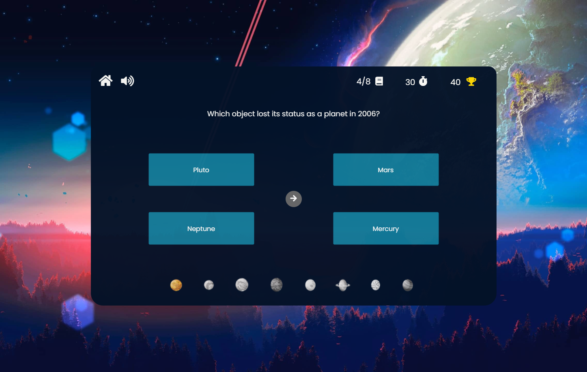
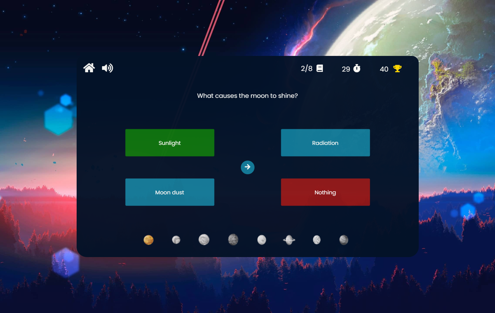
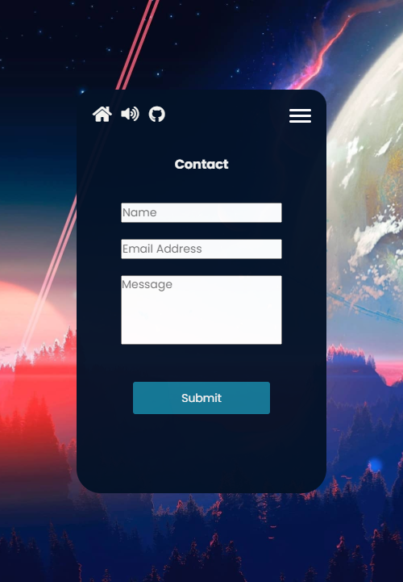

# **_The Astronomy Quiz - Project Portfolio 2 - JavaScript_**

The Astronomy Quiz is a small quiz that allows players to test their knowledge of Astronomy. The quiz consists of 3 different levels for the player to choose from, giving more points for harder difficulties. The quiz has 8 questions for each category and if they manage to answer the question correctly, they will receive points based on the difficulty plus additional points for answering the question as fast as they can. The Astronomy Quiz is a brilliant way to not only test your knowledge but also to learn, as the answer will be shown to the player if they either don't answer in time or answer incorrectly.

You can view the live site here - <a href="https://miker94.github.io/CI-Project-Portfolio-2/" target="_blank" rel="noopener">The Astronomy Quiz</a>

# Contents

* [**Objective**](<#objective>)
* [**User Experience UX**](<#user-experience-ux>)
    * [Design Prototype](<#design-prototype>)
    * [Site Structure](<#site-structure>)
    * [Design Choices](<#design-choices>)
    *  [Typography](<#typography>)
    *  [Colour Scheme](<#colour-scheme>)
* [**Features**](<#features>)
    * [Home](<#home-section>)
    * [Navigation](<#navigation-bar>)
    * [Difficulty](<#difficulty-section>)
    * [Question](<#question-section>)
    * [Results](<#results-section>)
    * [Rules](<#rules-section>)
    * [Hiscore](<#hiscore-section>)
    * [Contact](<#contact-section>)
* [**Future Features**](<#future-features>)
    * [Global Hiscores](<#global-hiscores>)
    * [Fact Of The Week](<#fact-of-the-week>)
    * [Monthly Polls](<#monthly-polls>)
    * [Global Sound](<#global-sound-settings>)
* [**Technologies Used**](<#technologies-used>)
* [**Testing**](<#testing>)
* [**Deployment**](<#deployment>)
* [**Credits**](<#credits>)
    * [**Content**](<#content>)
    * [**Media**](<#media>)
    * [**Code**](<#code>)
*  [**Acknowledgments**](<#acknowledgements>)

# Objective

In my second project, I intend to create a challenging, interactive and fun quiz game for user to test their knowledge on Astronomy. The main objective is to demonstrate competency in HTML, CSS and JavaScript alongside showcasing attention to detail and the importance of thorough testing.

[Back to top](<#contents>)

# User Experience (UX)

## Design Prototype

The design prototype for The Astronomy Quiz was produced in [Figma](https://www.figma.com/). There are design prototypes for Desktop and Mobile. The reason that the design prototype looks very similar to the finished product is because I've learnt that being able to visually see your design before you spend the time implementing it is a very efficient method when it comes to creating something in software development. Being able to use a tool like [Figma](https://www.figma.com/) to "drag and drop" elements will save a large amount of time as apposed to trying to design through CSS, therefore before I implemented something, I made sure to design it on [Figma](https://www.figma.com/) first.  

[Back to top](<#contents>)

## Site Structure

The Astronomy Quiz is a one-page website which has been designed to look like an application. When a user visits the website, they are instantly greeted on the [Home Page](index.html) and asked to enter a username. The quiz is very linear and clear so that the player is never left confused on how to play or what to do. The quiz also has a hamburger menu which the player can select to navigate to additional pages such as **Home**, **Rules**, **Hiscores** and **Contact**. When the player has finished the quiz, they will be presented with a score and then the option to play again which, if clicked, will take the player back to the [Home Page](index.html).

[Back to top](<#contents>)
## Design Choices

 * ### Typography
      The fonts chosen were 'Poppins' for the headings and for the body text however different font-weights and font-sizes were used to give further clarity. They fall back to sans-serif respectively if the Poppins font can't be loaded. 
     *  'Poppins' was chosen for the primarily to give the user an initial welcoming feel. The font-style is very modern and clean and gives a professional and inviting feeling to the website.

 * ### Colour Scheme
      The colour scheme eventually chosen is one based on primarily dark navy, light blue and an off white with the additional soft pink in the background image. This colour scheme gives off a very outer-space like feel and all colours compliment each other.  

[Back to top](<#contents>)
# Features

The Astronomy Quiz website is set up to be very easy to use and visually appealing for the player. It was designed with user-experience in mind. The player should feel like they are doing an Astronomy Quiz just by the visual theme and feel encouraged to keep playing to try and beat their current hiscore.

## Existing Features
  * ### Home Section

      * This is the first part of the quiz the user will see when visiting and is designed to allow the user to immediately get started with playing the quiz.
      * In the middle of the website the player will see the quiz application complimented by a beautiful space background.
      * Within the quiz application, the user will be greeted and then asked to submit a name and then click next to be directed to select a difficulty.  

<b>Desktop Home/Landing Page Image</b>

 

<b>Desktop Home/Landing Page Responsive Image</b>

 

[Back to top](<#contents>)

  * ### Navigation Bar

    * Located at the top of the quiz application and provides the user the ability to navigate back to the home page, enter the menu and turn the game sounds on or off. Whilst the player is currently playing the quiz, additional features show like the time left and the players current score.  

<b>Desktop Navigation Bar Image</b>

 

<b>Desktop Navigation Bar Image (Timer & Score)</b>

 

<b>Responsive Navigation Bar Image (Timer & Score)</b>

 

[Back to top](<#contents>)

  * ### Menu Section
    * I implemented a menu that the user can access at all times by pressing the 3 white lines in the top right. When pressed, these 3 white lines will disappear, a cross will be shown and then the menu will appear.
    * The user will have access to 4 navigation buttons **Home**, **Rules**, **Hiscores** and **Contact**.
    * If the user opens the menu during answering quiz questions, the game will not pause. This should promote fair play for all users    

<b>Desktop Menu Image</b>

 

<b>Responsive Menu Image</b>

 

[Back to top](<#contents>)

  * ### Difficulty Section

    * After the user has entered their name and clicked the next button on the home page, they will then be directed to this page where they can select a difficulty.
    * The quiz has 3 difficulty levels to choose from. Selecting easy will give 10 points per correct answers, medium will give 20 points per correct answer and hard will give 40 points per correct answer.  

<b>Desktop Difficulty Image</b>

 

<b>Responsive Difficulty Image</b>

 

[Back to top](<#contents>)

* ### Question Section
    
    * This is the core of the game. The user is asked to answer 8 questions that are Astronomy related and the difficulty of the questions will be determined by what difficulty the user selects in the difficulty section
    * I decided to do 8 questions as there are 8 planets in our solar system. It's a small niche addition that hopefully the user may spot.
    * Each question is randomly displayed from a list of pre-determined questions created from questions.js.
    * If the player answers a correct answer, a "correct sound" noise will play, the correct answer will highlight green, the planet icon will light up, the time will pause and the player will receive points determined by difficulty for answering the question plus additional points equal to the time left. The next question icon will then show after 0.5 seconds.
    * If the players answers incorrectly, an "incorrect sound" noise will play, the correct answer will highlight green, the users selected answer will highlight red and the user will not score points. The next question icon will then show after 0.5 seconds.  
    

<b>Desktop Question Image</b>

 

<b>Desktop Question Correct Answer Image</b>

 

<b>Desktop Question Wrong Answer Image</b>

 

<b>Responsive Question Image</b>

 

<b>Responsive Question Correct Answer Image</b>

 

<b>Responsive Question Wrong Answer Image</b>

 

[Back to top](<#contents>)

* ### Results Section
    
    * When the user finishes the quiz, they will then presented with a results page which will display the users score and then give them the option to play again if they wish to.  
    

<b>Desktop Results Image</b>

 

<b>Responsive Results Image</b>

 

[Back to top](<#contents>)

* ### Rules Section
    
    * Created to give the user a further understanding of the game and can be access via the menu.
    * As well as having informative text, additional icons have been added to further aid the user in understanding.  
    

<b>Desktop Rules Image</b>

 

<b>Responsive Rules Image</b>

 

[Back to top](<#contents>)

* ### Hiscore Section
    
    * Shows the user the current top 3 hiscores.
    * All scores are saved in local storage so users can only compete with anyone who attempts the quiz on the same machine.
    * The user has the ability to clear the hiscores and start fresh if they wish to do so.  
    

<b>Desktop Hiscore Image</b>

 

<b>Responsive Hiscore Image</b>

 

[Back to top](<#contents>)

* ### Contact Section
    
    * Allows the user to submit any feedback, questions or concerns they may have.
    * Created with [Email.JS](https://www.emailjs.com/) and allows for emails to be sent directly to a new email address created for this project.
    * Additional functionality added to provide the user some visual information as to whether their message has been successfully sent or not.   
    

<b>Desktop Contact Image</b>

 

<b>Desktop Contact Sent Image</b>

 

<b>Desktop Contact Error Image</b>

 

<b>Responsive Contact Image</b>

 

[Back to top](<#contents>)

* ## Future Features 

* ### Global Hiscores

    * Instead of hiscores saving locally, having the hiscores save globally would be much engaging for the user as they would be able to compete with others around the world to test their knowledge.

* ### Fact Of The Week

    * Having a page dedicated to displaying interesting Astronomy facts weekly would increase the the chances of people returning to the website/quiz application to see the new fact.

* ### Monthly Polls

    * Having a poll section where the player can submit their vote on a poll and then see results from others around the world would be a good way of seeing peoples different views and opinions on astronomy related topics. For example, "Which is your favourite planet?".

* ### Global Sound Settings

    * I believe it would be much more intuitive to save the users sound settings in local storage so that when the user refreshes the page, they don't have to keep turning the sound off every time if they don't wish to hear sound.

[Back to top](<#contents>)

# Technologies Used
* [HTML5](https://en.wikipedia.org/wiki/HTML) - Provides the content and structure for the website.
* [CSS3](https://en.wikipedia.org/wiki/CSS) - Provides the styling for the website.
* [JavaScript](https://en.wikipedia.org/wiki/JavaScript) - Provides the functionality of the website.
* [Figma](https://www.figma.com/) - Used to create the design prototype.
* [a11y](https://color.a11y.com/Contrast/) - Used to test the contrast and accessibility.
* [Favicon](https://favicon.io/) - Used to create the favicon.
* [Compressor](https://compressor.io/) - Used to compress the images.
* [VSCode](https://code.visualstudio.com/) - Used to create and edit the website.
* [GitHub](https://github.com/) - Used to host and deploy the website.
* [GitBash](https://en.wikipedia.org/wiki/Bash_(Unix_shell)) - Terminal used to push changes to the GitHub repository.
* [EmailJS](https://www.emailjs.com/) - Used to implement a working email system.
* [removebg](https://www.remove.bg/) - Used to remove background images.

[Back to top](<#contents>)

# Testing

* ## Code Validation

    * Insert text here   

* ### HTML Validation Image

    

* ### CSS Validation Image

    

* ### JS Validation Image

    

* ## Lighthouse Testing 

    * Furthermore the website has been through the [Chrome Dev Tools](https://developer.chrome.com/docs/devtools/) and [Microsoft Edge Dev Tools](https://docs.microsoft.com/en-us/microsoft-edge/devtools-guide-chromium/open/?tabs=cmd-Windows) Lighthouse Testing which tests the website for the following:
        * Performance - How the page performs whilst loading.
        * Accessibility - Is the site accessible for all users and how can it be improved.
        * Best Practices - Site conforms to industry best practices.
        * SEO - Search Engine Optimisation. Is the site optimised for search engine result rankings.  

* ### Edge Desktop Lighthouse Result

    

* ### Edge Mobile Lighthouse Result

    

* ### Chrome Desktop Lighthouse Result

    

* ### Chrome Mobile Lighthouse Result

    

    * Insert text here  

* ## Accessibility Testing
    * I also put the website through [a11y](https://color.a11y.com/Contrast/) to further test the contrast and found no issues.    

    

* ## Responsiveness Testing
    * The responsive design tests were carried out manually with [Google Chrome DevTools](https://developer.chrome.com/docs/devtools/) and [Responsive Design Checker](https://www.responsivedesignchecker.com/).  

    

* ## Compressing Images
    * All images have been compressed with [Compressor](https://compressor.io/) and I managed to save a total of 1568 KB.  

    

    

    

    

* ## Manual Testing
    * In addition to the other tests, I have conducted a manual check list for myself to carry out to make sure that everything is working as intended.

   * ### Manual Tests Conducted
      * Feature Manual Tested
        * Verify step here
      * Feature Manual Tested
        * Verify step here
          

* ## Browser Compatibility
    * The website has had manual and responsive tests conducted on the below browsers with additional Lighthouse testing on Google Chrome and Microsoft Edge and I was presented with no issues.
        * Google Chrome
        * Microsoft Edge
        * Safari
          

* ## Bugs Fixed 

    ### Console Error
        
    * Insert text here  

    

     * Insert text here  

    

* ## Bugs Unresolved  
    * Insert text here  

    
    

[Back to top](<#contents>)

# Deployment

### **To deploy the project**
The site was deployed to GitHub pages. The steps to deploy a site are as follows:
  1. In the GitHub repository, navigate to the **Settings** tab.
  2. Once in Settings, navigate to the **Pages** tab on the left-hand side.
  3. Under **Source**, select the branch to **master**, then click **save**.
  4. Once the master branch has been selected, the page will be automatically refreshed with a detailed ribbon display to indicate the successful deployment.

<b>Git Deploy Preview Image</b>

### **To fork the repository on GitHub**
A copy of the GitHub Repository can be made by forking the GitHub account. This copy can be viewed and changes can be made to the copy without affecting the original repository. Take the following steps to fork the repository;
1. Log in to **GitHub** and locate the [repository](https://github.com/MikeR94/CI-Project-Portfolio-2).
2. On the right-hand side of the page inline with the repository name is a button called **'Fork'**, click on the button to create a copy of the original repository in your GitHub Account.

<b>Git Fork Preview Image</b>

### **To create a local clone of this project**
The method from cloning a project from GitHub is below:

1. Under the repository’s name, click on the **code** tab.
2. In the **Clone with HTTPS** section, click on the clipboard icon to copy the given URL.
3. In your IDE of choice, open **Git Bash**.
4. Change the current working directory to the location where you want the cloned directory to be made.
5. Type **git clone**, and then paste the URL copied from GitHub.
6. Press **enter** and the local clone will be created.

<b>Git Clone Preview Image</b>

The live link to the Github repository can be found here - https://github.com/MikeR94/CI-Project-Portfolio-2

[Back to top](<#contents>)

# Credits
### Content

* The font came from [Google Fonts](https://fonts.google.com/)
* The colour palette was displayed by [Coolors](https://coolors.co/)
* The HTML icons came from [Font Awesome](https://fontawesome.com/)
* The responsive preview image at the top of the README.md came from [Techsini](https://techsini.com/multi-mockup/index.php)
* The favicon came from [Favicon](https://favicon.io/)
* The questions and answers came from [TriviaWell](https://www.triviawell.com/), [IcebreakerIdeas](https://icebreakerideas.com/), [FreePubQuiz](http://www.freepubquiz.co.uk/), [eadt](https://www.eadt.co.uk/) and [QuizGlobal](https://quizglobal.com/)

### Media
* The background image came from [WallpapersMug](https://wallpapersmug.com/)
* The favicon image came from [flaticon](https://www.flaticon.com/) and then turned into a favicon by [Favicon](https://favicon.io/)
* The icons for the planets came from [VectorStock](https://www.vectorstock.com/)
* The icons for the hiscore ribbons came from [iStock](https://www.istockphoto.com/)
* The photos were compressed using [Compressor](https://compressor.io/)

### Code
* The code for the hiscores was based off guidance and inspiration from a user name [Minna N](https://dev.to/minna_xd). I used this link [DevTo](https://dev.to/minna_xd/adding-a-high-score-table-to-javascript30-whack-a-mole-4adk) to gain a good understanding of what is required to create a hiscores system using local storage and then implemented a version of my own for The Astronomy Quiz.
* For the contact form, I wanted to be able to actually receive emails and understand how that can be achieved. I stumbled upon a brilliant website called [EmailJS](https://www.emailjs.com/docs/user-guide/creating-email-templates/) that has some very clear and informative documentation which explains how you can embed a working email system on your website.
* When searching how I could implement audio through JavaScript, I found this [StackOverflow](https://stackoverflow.com/questions/9419263/how-to-play-audio) post which explained some basic concepts on how to achieve it. After managing to implement audio on my quiz, I decided to refactor the code to make it more readable and also reusable.
* I feel like adding a timer on a quiz can make it more engaging for the user and provide a better user experience. After searching online for some information, I found this [StackOverflow](https://stackoverflow.com/questions/44314897/javascript-timer-for-a-quiz) post which shows a basic example of a countdown timer. After understanding the fundamentals behind it, I decided to implement it but refactor it to suit my needs.

[Back to top](<#contents>)

# Acknowledgments
The site was completed as a part of a Full Stack Software Developer Diploma at the [Code Institute](https://codeinstitute.net/) and is my Portfolio Project 2. I would like to thank my mentor [Precious Ijege](https://www.linkedin.com/in/precious-ijege-908a00168/), my educator [Luke Walters](https://www.linkedin.com/in/luke-walters-leatherbarrow-531107101/), and my brother [Jack Ralph](https://www.linkedin.com/in/jackthomasralph/), the Slack community, and all at the Code Institute for their help and support.

Mike Ralph 2021.

[Back to top](<#contents>)